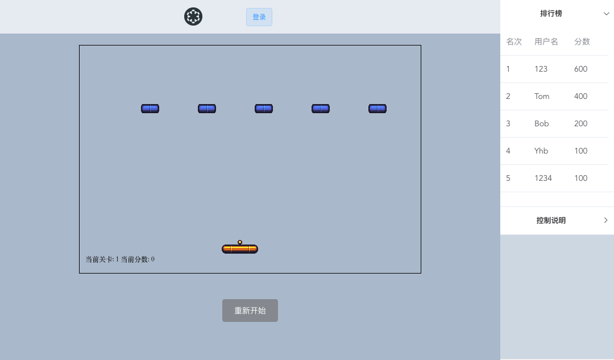
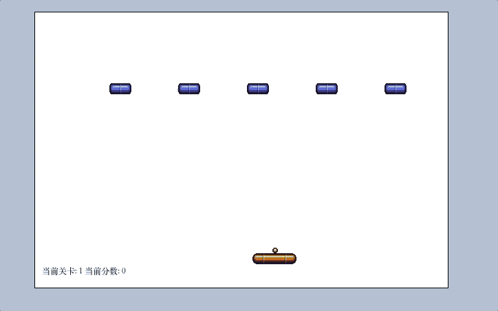
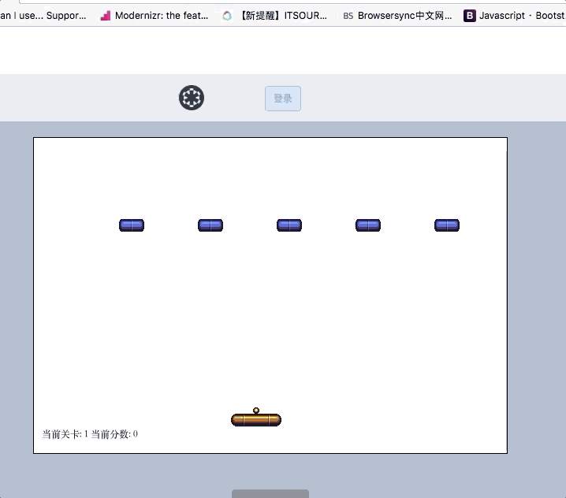
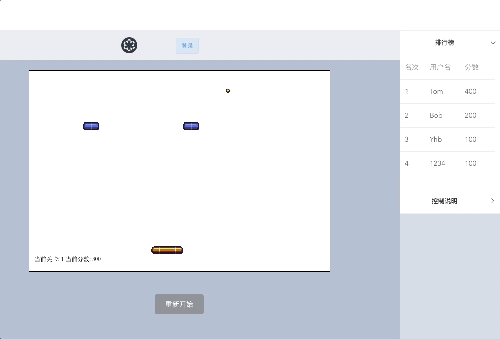

# 期末大作业

> 打砖块游戏

## 运行方法

``` bash
# 安装依赖
npm install

# 运行本地服务器
node server/bin/back.js

# 打包
npm start

```

## 使用到了
* vue/vue-router
* axios
* express
* element-ui
* stylus


## 自我评估表
|    功能    | 分数 |
| ---------- | --- |
| Axios api |  3 |
| Vue框架       |  5 |
|express|3|
|本地储存|3|
|响应式设计|2|
|restful api|2|
|css预处理器 stylus|3|

## 实现的功能
* 多个关卡
* 排行榜
* 用户登录
* 本地储存用户积分


### 游戏界面




### 登录功能


### 多个关卡


### 死亡后保存成绩


## 遇到的困难及如何解决

* 解决了Vue中兄弟组件之间的通信问题,
	* 在子组件中通过this.$emit()触发父组件的方法,在父组件中通过this.$refs相应的调用兄弟子组件的方法实现数据的交换

* 解决了获取分数后分数存储的问题
	* 主要代码如下(express框架)
	
``` javascript
app.get("/api/data",function (request,response) {
  const change = parseInt(request.param('change'))
  if (change === 1) {
    const name = request.param('name')
    if (name === '匿名') return
    const score = request.param('score')

    let newData = JSON.parse(data)
    newData[name] = score

    fs.writeFileSync(dataPath, JSON.stringify(newData)) // json文件的重写
  } else {
    response.send(data);
  }
})

```

* 解决了跨域问题(webpack和express开启的服务器端口不同)
	* 通过proxyTable代理转发
	
``` javascript
proxyTable: {
      '/api': {
        target: 'http://localhost:3000',
        changeOrigin: true,
      }
    }
```

* 2个矩形的碰撞判断

``` javascript
function intersect(rect1, rect2) {
  const half1Width = rect1.width / 2
  const half1Height = rect1.height / 2
  const half2Width = rect2.width / 2
  const half2Height = rect2.height / 2

  const cen1 = {
      x: rect1.x + half1Width,
      y: rect1.y + half1Height
    }
  const  cen2 = {
      x: rect2.x + half2Width,
      y: rect2.y + half2Height
    }

    return Math.abs(cen2.x - cen1.x) <= half1Width + half2Width && Math.abs(cen2.y - cen1.y) <= half1Height + half2Height
}
```