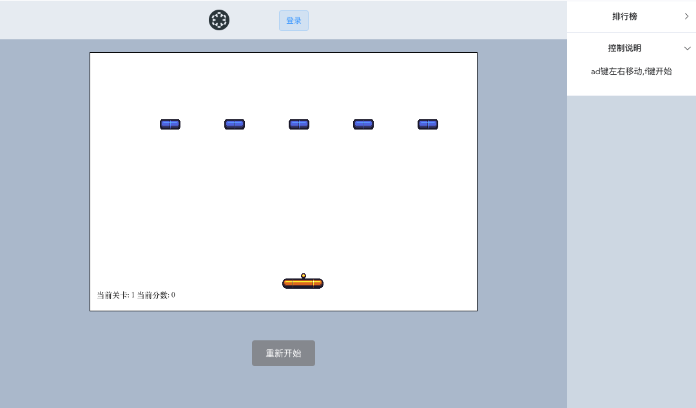

# 期末大作业

> 打砖块游戏

## 运行方法

``` bash
# 安装依赖
npm install

# 运行本地服务器
node server/bin/back.js

# 打包
npm start

```

## 实现的功能
* 多个关卡
* 排行榜
* 用户登录
* 本地储存用户积分

## 使用到了
* vue/vue-router
* axios
* express
* element
* stylus

## 游戏界面


